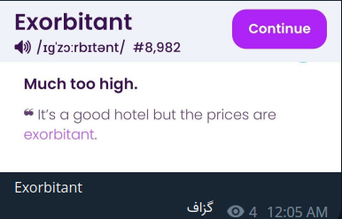

# Langhelper

A simple telegram bot, that receives words with a specific format and then helps you memorize it. 
This is just a hobby of mine

## Usage
To populate this bot with words you want to learn, you can add it to a channel or 
group and send the words there. This bot will collect them automatically. You can
also send words directly to the bot. The words should follow the format specified below:



This bot will add all the words in a sqlite database and the with the `/random` command,
Will ask the words.


## How to build
To build the project simply run:
```bash
make build
```

To make a docker image:
```bash
DOCKER_USER=example make docker
```

## How to Run
To run this project you need provide you bot token either through command line arguments
or by setting `BOT_TOKEN` env. You can also provide `.env` file or use the default location,
which is `<working directory>/.env`. Then you can run:

```bash
make run
```
Or with docker:
```bash
docker run -e BOT_TOKEN=bot12341234:SAMPLETOKEN sinashk/langhelper:latest
```
You can run with `-h` or `-help` to see the possible arguments:
```bash
./build/langhelper -h
```

## Backup

To run backup you need to specify at least to arguments, 

1.`-backup` to enable backups.
2. `-backup-receiver <telegram-userid>` to specify where backups should be sent.

Also you can change the backup interval (default is `24h`) with the `-backup-interval` flag.
**If a crash happens, an attempt to send a backup will be preformed. Not sure how effective that is though.**